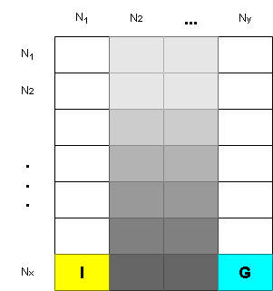

# navigator
 
## Descripción del Dominio: Navigation

En el dominio **Navigation**, un robot camina por un grid de dimensiones `Nx x Ny` (Figura 1). En este dominio, el robot comienza su recorrido en una posición inicial `S0` y trata de alcanzar una posición destino.

- En la primera y últimas filas del grid (`y=1` y `y=Ny`), las acciones son **determinísticas**.
- En las filas intermedias, el robot tiene una **probabilidad P(x,y)** de desaparecer (*deadend*). Esta probabilidad crece conforme el robot se acerca al objetivo.  
  _(En la Fig. 1, mientras más oscura es la tonalidad gris, mayor es la probabilidad de desaparecer)._  

### Características del dominio:

1. Las acciones tienen un costo de **uno** y corresponden a moverse en las cuatro direcciones cardinales.
2. La posición inicial `S0` está ubicada en `X0 = Nx, Y0 = 1`.
3. El objetivo se encuentra en `Xg = Nx, Yg = Ny`.

Aunque este dominio es simple, tiene características que lo hacen **desafiante desde el punto de vista del aprendizaje automático**.  
El problema involucra:
- **Incertidumbre**: debido a la probabilidad de desaparición.
- **Riesgo**: asociado a las decisiones.
- **Complejidad en la toma de decisiones**: para poder llegar a la meta.

    
    
 

    <figcaption><b>Figura 1:</b> Representación del grid Navigation.</figcaption>

## Descripción de los problemas:

Los problemas están descritos en archivos `.json`. En dichos archivos, los estados están numerados desde la fila 0 hasta la fila `Ny` y desde la columna 1 hasta la columna `Nx` en orden correlativo. Cada entrada dentro del  archivo `.json` corresponde a la descripción de un estado (Ver Figura 2). La descripción especifica si el estado es un estado objetivo o deadend y una lista de los estados adyacentes (“Adj”). Cada estado adyacente describe las acciones `“A”: “N” (norte), ”S” (sur), ”E”(este) y ”W” (oeste)` que pueden llevar a él con la respectiva probabilidad de transición.

